# Automated Feature Engineering Engine

A powerful Python library that automatically generates, scores, and selects the best features for tabular datasets. This tool streamlines the feature engineering process by implementing common transformations and intelligent feature selection, making it easy to improve model performance with minimal manual effort.

## Description

The Automated Feature Engineering Engine is designed to automate the tedious and time-consuming process of feature engineering for machine learning models. It applies a variety of feature transformations, scores them using statistical methods, and automatically selects the top-k most informative features for your model.

### Key Capabilities

- **Automatic Feature Generation**: Creates polynomial features, binned features, and target-encoded features
- **Intelligent Feature Scoring**: Uses mutual information or correlation to rank feature importance
- **Top-K Feature Selection**: Automatically selects the best features for model training
- **scikit-learn Integration**: Seamlessly integrates with scikit-learn pipelines and transformers
- **Flexible Configuration**: Customizable parameters for different use cases

## Features

### Feature Transformations

1. **Polynomial Features**: Generates polynomial and interaction features up to a specified degree
2. **Feature Binning**: Discretizes continuous features into bins for better handling of non-linear relationships
3. **Target Encoding**: Encodes categorical variables using target statistics (mean encoding)

### Feature Scoring

- **Mutual Information**: Measures the dependency between features and target (classification and regression)
- **Correlation-based**: Alternative scoring methods for feature selection

### Pipeline Integration

- Compatible with scikit-learn's `Pipeline` and `GridSearchCV`
- Follows scikit-learn's fit/transform API conventions
- Supports both classification and regression tasks

## Installation

### Prerequisites

- Python 3.7+
- pip

### Install Dependencies

```bash
pip install -r requirements.txt
```

### Required Packages

- `pandas` - Data manipulation and analysis
- `numpy` - Numerical computing
- `scikit-learn` - Machine learning utilities
- `featuretools` - Advanced feature engineering (optional, for future enhancements)
- `streamlit` - Web application framework (for interactive UI)
- `plotly` - Interactive visualization library (for Streamlit app)

### Running the Streamlit Web Application

For an interactive web interface, you can run the Streamlit app:

```bash
streamlit run app.py
```

The app will open in your browser at `http://localhost:8501` and provides:
- 📊 Dataset upload or sample dataset selection
- ⚙️ Configurable feature engineering parameters
- 📈 Interactive visualizations and metrics
- 🤖 Model benchmarking and comparison
- 💾 Download engineered datasets and results

## Quick Start

### Basic Usage

```python
import pandas as pd
from sklearn.datasets import load_breast_cancer
from sklearn.model_selection import train_test_split
from sklearn.ensemble import RandomForestClassifier
from sklearn.metrics import accuracy_score
from auto_feature_engineer import AutoFeatureEngineer

# Load dataset
data = load_breast_cancer()
X = pd.DataFrame(data.data, columns=data.feature_names)
y = pd.Series(data.target)

# Split data
X_train, X_test, y_train, y_test = train_test_split(
    X, y, test_size=0.2, random_state=42
)

# Initialize and fit the feature engineer
afe = AutoFeatureEngineer(k=25, task="classification")
X_train_fe = afe.fit_transform(X_train, y_train)
X_test_fe = afe.transform(X_test)

# Train model with engineered features
clf = RandomForestClassifier(random_state=42)
clf.fit(X_train_fe, y_train)
preds = clf.predict(X_test_fe)

print("Accuracy with engineered features:", accuracy_score(y_test, preds))
```

### Using with CSV Data

```python
import pandas as pd
from auto_feature_engineer import AutoFeatureEngineer

# Load your dataset
df = pd.read_csv('breast_cancer.csv')
X = df.drop('target', axis=1)
y = df['target']

# Apply feature engineering
afe = AutoFeatureEngineer(k=30)
X_engineered = afe.fit_transform(X, y)
```

## API Documentation

### `AutoFeatureEngineer`

Main class for automated feature engineering.

#### Parameters

- `k` (int, default=20): Number of top features to select
- `task` (str, default="classification"): Task type - "classification" or "regression"

#### Methods

- `fit(X, y)`: Fit the feature engineer on training data
  - `X`: Feature matrix (pandas DataFrame)
  - `y`: Target vector (pandas Series or array)
  - Returns: self

- `transform(X, y=None)`: Transform data using fitted feature engineer
  - `X`: Feature matrix (pandas DataFrame)
  - `y`: Optional target vector (for target encoding, if not fitted)
  - Returns: Transformed feature matrix with selected features

- `fit_transform(X, y)`: Fit and transform in one step
  - `X`: Feature matrix (pandas DataFrame)
  - `y`: Target vector (pandas Series or array)
  - Returns: Transformed feature matrix

### `FeatureGenerator`

Class responsible for generating new features.

#### Parameters

- `poly_degree` (int, default=2): Degree of polynomial features
- `n_bins` (int, default=5): Number of bins for discretization

#### Methods

- `polynomial_features(X, fit=False)`: Generate polynomial features
- `bin_features(X, fit=False)`: Generate binned features
- `target_encode(X, y=None, fit=False)`: Apply target encoding
- `generate(X, y=None, fit=False)`: Generate all feature types

### `FeatureScorer`

Class for scoring feature importance.

#### Parameters

- `task` (str, default="classification"): Task type for appropriate scoring method

#### Methods

- `score(X, y)`: Score features and return sorted Series
  - `X`: Feature matrix
  - `y`: Target vector
  - Returns: pandas Series with feature scores (sorted descending)

## Example Scripts

### Example 1: Basic Classifier Integration

See `example_classifier.py` for a complete example of integrating the feature engineer with a classifier.

```bash
python example_classifier.py
```

### Example 2: Benchmark Comparison

See `benchmark.py` for a comparison between raw features and engineered features.

```bash
python benchmark.py
```

This script will output:
- Accuracy with raw features
- Accuracy with engineered features
- Performance improvement

## Benchmarking

The library includes a benchmark script (`benchmark.py`) that compares model performance with and without feature engineering. Typical results show:

- **Raw Features**: Baseline performance using original features
- **Engineered Features**: Improved performance using automatically generated and selected features

Run the benchmark:

```bash
python benchmark.py
```

Expected output:
```
Raw Accuracy: 0.9474
Engineered Accuracy: 0.9649
```

## Advanced Usage

### Customizing Feature Generation

```python
from feature_generation import FeatureGenerator

# Custom polynomial degree and binning
generator = FeatureGenerator(poly_degree=3, n_bins=10)
X_new = generator.generate(X, y, fit=True)
```


```python
from sklearn.pipeline import Pipeline
from sklearn.ensemble import RandomForestClassifier
from auto_feature_engineer import AutoFeatureEngineer

# Create pipeline
pipeline = Pipeline([
    ('feature_engineer', AutoFeatureEngineer(k=25)),
    ('classifier', RandomForestClassifier())
])

# Fit and predict
pipeline.fit(X_train, y_train)
predictions = pipeline.predict(X_test)
```

### Regression Tasks

```python
from auto_feature_engineer import AutoFeatureEngineer

# For regression tasks
afe = AutoFeatureEngineer(k=30, task="regression")
X_engineered = afe.fit_transform(X_train, y_train)
```

## Project Structure

```
Automated_Feature_Engineering_Engine/
├── auto_feature_engineer.py    # Main AutoFeatureEngineer class
├── feature_generation.py        # Feature generation utilities
├── feature_scoring.py           # Feature scoring methods
├── example_classifier.py        # Example usage with classifier
├── benchmark.py                 # Benchmark script
├── download_dataset.py          # Script to download sample dataset
├── streamlit_app.py             # Interactive web application
├── breast_cancer.csv            # Sample dataset (generated)
├── requirements.txt             # Python dependencies
└── README.md                    # This file
```

## Dataset

The project includes a sample dataset (`breast_cancer.csv`) based on the UCI Breast Cancer Wisconsin dataset. This dataset contains:

- **569 samples**
- **30 features** (mean, standard error, and worst values of various cell measurements)
- **Binary classification task** (malignant vs. benign)

To regenerate the dataset:

```bash
python download_dataset.py
```

## How It Works

1. **Feature Generation**: 
   - Applies target encoding to categorical features
   - Generates polynomial features from numeric columns
   - Creates binned versions of continuous features

2. **Feature Scoring**:
   - Computes mutual information scores for each feature
   - Ranks features by their importance to the target

3. **Feature Selection**:
   - Selects the top-k features based on scores
   - Returns transformed dataset with only selected features

## Pipeline Flowchart

The following flowchart illustrates the complete structure and workflow of the Automated Feature Engineering Engine:


### Component Architecture


### Data Flow Diagram

```mermaid
flowchart LR
    subgraph Input["Input Data"]
        X1[Original Features<br/>X: DataFrame]
        Y1[Target Variable<br/>y: Series]
    end
    
    subgraph Stage1["Stage 1: Feature Generation"]
        TE1[Target Encoding]
        Poly1[Polynomial Features<br/>x1², x2², x1×x2, ...]
        Bin1[Binned Features<br/>x1_bin, x2_bin, ...]
    end
    
    subgraph Stage2["Stage 2: Feature Pool"]
        Combined[Combined Feature Set<br/>Original + Polynomial + Binned<br/>N features]
    end
    
    subgraph Stage3["Stage 3: Feature Scoring"]
        Score1[Compute Mutual Information<br/>for each feature]
        Rank1[Rank Features<br/>by Score]
    end
    
    subgraph Stage4["Stage 4: Feature Selection"]
        Select1[Select Top-K Features<br/>k best features]
    end
    
    subgraph Output["Output Data"]
        X2[Engineered Features<br/>X_transformed: DataFrame<br/>k features]
    end
    
    X1 --> TE1
    Y1 --> TE1
    X1 --> Poly1
    X1 --> Bin1
    TE1 --> Combined
    Poly1 --> Combined
    Bin1 --> Combined
    Combined --> Score1
    Y1 --> Score1
    Score1 --> Rank1
    Rank1 --> Select1
    Combined --> Select1
    Select1 --> X2
    
    style Input fill:#e1f5ff
    style Stage1 fill:#fff4e1
    style Stage2 fill:#f3e5f5
    style Stage3 fill:#ffebee
    style Stage4 fill:#e8f5e9
    style Output fill:#e1f5ff
```



## Configuration Options

### AutoFeatureEngineer Parameters

- `k`: Number of features to select (default: 20)
- `task`: "classification" or "regression" (default: "classification")

### FeatureGenerator Parameters

- `poly_degree`: Degree of polynomial features (default: 2)
- `n_bins`: Number of bins for discretization (default: 5)

## Contributing

Contributions are welcome! Areas for improvement:

- Additional feature transformations
- More scoring methods (correlation, chi-square, etc.)
- Support for time-series features
- Integration with more ML frameworks
- Performance optimizations

## License

This project is open source and available for educational and research purposes.

## Acknowledgments

- Built with [scikit-learn](https://scikit-learn.org/)
- Uses datasets from the [UCI Machine Learning Repository](https://archive.ics.uci.edu/)
- Inspired by automated feature engineering best practices

## Support

For questions, issues, or contributions, please open an issue on the project repository.

---

**Happy Feature Engineering!**
